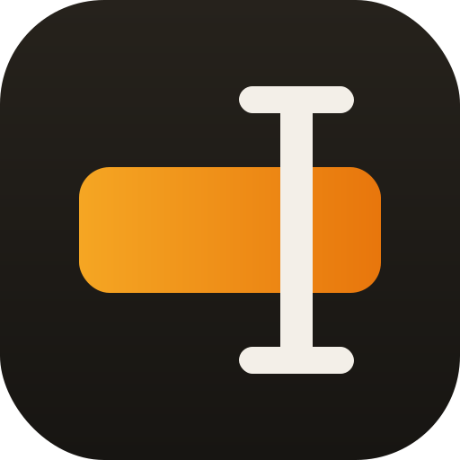

# Marker

Linux-style primary selection for macOS. Select text in any app — it is
captured into Marker's history and (by default) placed on the system
clipboard, ready to Cmd+V. Prefer your clipboard untouched? Turn off
"To clipboard" and Marker runs in strict X11-primary mode: selections
go to the separate history only.

## Features

- Watches text selections system-wide via the Accessibility API.
- Auto-copy to the system clipboard — on by default, toggleable for
  strict separate-buffer mode.
- Fallback capture for apps that hide selections from Accessibility
  (Telegram, kitty, …): synthesized Cmd+C or detection of the app's own
  copy-on-select, with the previous clipboard restored afterwards.
- Unlimited history, grouped by day, with search and per-app filter;
  source app icon and timestamp on every entry.
- **⌥V** pastes the most recent selection into the active app. The system
  clipboard is briefly swapped and then restored.
- Menu bar popover: click any history entry to copy it to the clipboard.
- Auto-updates via Sparkle.

## Build & run

```sh
./build-app.sh
open build/Marker.app
```

On first launch macOS asks for **Accessibility** permission
(System Settings → Privacy & Security → Accessibility). Marker starts
watching selections as soon as it is granted — no relaunch needed.

## Notes & limitations

- Apps with poor Accessibility support (some Electron apps, some Java
  apps) may not report selections.
- History is stored unencrypted in a local SQLite database
  (`~/Library/Application Support/Marker`). Use Clear for anything you
  don't want persisted; nothing ever leaves your Mac.
## Privacy & license

No analytics, no telemetry; the network is used only for Sparkle update
checks. Details: [privacy policy](https://getwaymark.net/marker/privacy/).
[MIT](LICENSE).
